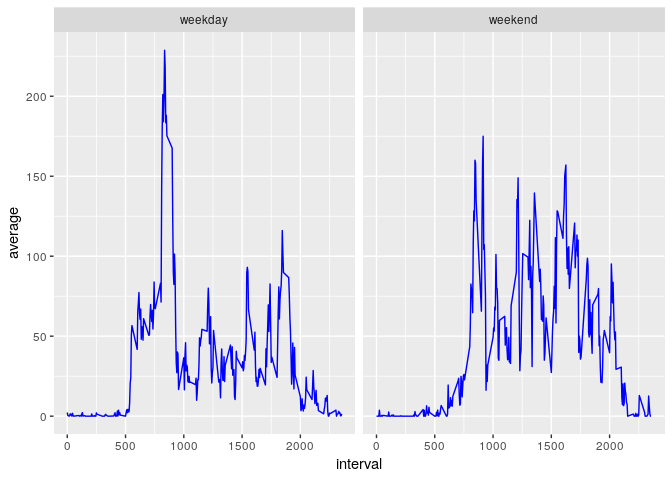

## Set the working directory and load dependencies

```r
setwd('~/DataScience/datasciencecoursera/datasciencecoursera/Reproducible_research/Project_1/RepData_PeerAssessment1')
library(knitr)
library(dplyr)
```

```
## 
## Attaching package: 'dplyr'
```

```
## The following objects are masked from 'package:stats':
## 
##     filter, lag
```

```
## The following objects are masked from 'package:base':
## 
##     intersect, setdiff, setequal, union
```

```r
library(ggplot2)
```

## Set Global Knitr options

```r
opts_chunk$set(warning = F)
```

## Download the data

```r
fileUrl = "https://d396qusza40orc.cloudfront.net/repdata%2Fdata%2Factivity.zip"
destFile = "Factivity.zip"

if (!file.exists(destFile))
    download.file(fileUrl, destfile = destFile, mode = "auto")

folderName = "activity.csv"

if(!file.exists(folderName))
    unzip(destFile)

rm(destFile, folderName, fileUrl)
```

## Loading and exploring the data structure

```r
activity_data <- read.csv("activity.csv", na.strings = "NA")
dim(activity_data)
```

```
## [1] 17568     3
```

```r
head(activity_data)
```

```
##   steps       date interval
## 1    NA 2012-10-01        0
## 2    NA 2012-10-01        5
## 3    NA 2012-10-01       10
## 4    NA 2012-10-01       15
## 5    NA 2012-10-01       20
## 6    NA 2012-10-01       25
```

```r
str(activity_data)
```

```
## 'data.frame':	17568 obs. of  3 variables:
##  $ steps   : int  NA NA NA NA NA NA NA NA NA NA ...
##  $ date    : Factor w/ 61 levels "2012-10-01","2012-10-02",..: 1 1 1 1 1 1 1 1 1 1 ...
##  $ interval: int  0 5 10 15 20 25 30 35 40 45 ...
```

```r
range(activity_data$steps, na.rm = T)
```

```
## [1]   0 806
```

```r
levels(activity_data$date)
```

```
##  [1] "2012-10-01" "2012-10-02" "2012-10-03" "2012-10-04" "2012-10-05"
##  [6] "2012-10-06" "2012-10-07" "2012-10-08" "2012-10-09" "2012-10-10"
## [11] "2012-10-11" "2012-10-12" "2012-10-13" "2012-10-14" "2012-10-15"
## [16] "2012-10-16" "2012-10-17" "2012-10-18" "2012-10-19" "2012-10-20"
## [21] "2012-10-21" "2012-10-22" "2012-10-23" "2012-10-24" "2012-10-25"
## [26] "2012-10-26" "2012-10-27" "2012-10-28" "2012-10-29" "2012-10-30"
## [31] "2012-10-31" "2012-11-01" "2012-11-02" "2012-11-03" "2012-11-04"
## [36] "2012-11-05" "2012-11-06" "2012-11-07" "2012-11-08" "2012-11-09"
## [41] "2012-11-10" "2012-11-11" "2012-11-12" "2012-11-13" "2012-11-14"
## [46] "2012-11-15" "2012-11-16" "2012-11-17" "2012-11-18" "2012-11-19"
## [51] "2012-11-20" "2012-11-21" "2012-11-22" "2012-11-23" "2012-11-24"
## [56] "2012-11-25" "2012-11-26" "2012-11-27" "2012-11-28" "2012-11-29"
## [61] "2012-11-30"
```

```r
range(activity_data$interval)
```

```
## [1]    0 2355
```

The results of exploring the data structure tells us that the data consists of 17568 rows and 3 columns. The first column represents the number of steps taken in a given interval in a given day and the values has a range of [0, 806] with some missing values represented as NA. The second column represents the date of the day the reading has been taken and it is represented as character factor with 61 levels, meaning we have readings for 61 days starting on 2012-10-01 and ending on 2012-11-30. The third column is an int vector representing the 5 minute interval on which the reading has been taken in a given day, the numbers start from 0 adding 5 to represent the next interval and then ceiling to the next hundred on the start of a new hour to mark it.

## Preprocessing the data
For now all we need is to change the date variable in the data frame to Date class instead of factor class.

```r
class(activity_data$date)
```

```
## [1] "factor"
```

```r
activity_data$date <- as.Date(activity_data$date)
class(activity_data$date)
```

```
## [1] "Date"
```

## 1. What is mean total number of steps taken per day?

```r
total_steps_per_day <- tapply(activity_data$steps, activity_data$date, sum, na.rm = T)
hist(total_steps_per_day, col = "Blue", xlab = "Total steps per day", main = "Total steps per day distribution", breaks = seq(0, 25000, by = 1000))
```

<!-- -->

Mean value of total steps per day

```r
mean(total_steps_per_day)
```

```
## [1] 9354.23
```
Median value of total steps per day

```r
median(total_steps_per_day)
```

```
## [1] 10395
```

```r
rm(total_steps_per_day)
```

## What is the average daily activity pattern?

```r
average_steps_per_interval <-  activity_data %>% group_by(interval) %>% summarize(average = mean(steps, na.rm = T))
plot(average_steps_per_interval$interval, average_steps_per_interval$average, type = "l", col = "Blue", xlab = "Interval", ylab = "Average", main = "Average steps per interval")
```

<!-- -->

Maxmium average steps taken per interval

```r
max(average_steps_per_interval$average)
```

```
## [1] 206.1698
```
Interval in which maxmium steps where taken

```r
average_steps_per_interval[which.max(average_steps_per_interval$average), 1][[1]]
```

```
## [1] 835
```

```r
rm(average_steps_per_interval)
```

## Imputing missing values
Number of missing values

```r
sum(is.na(activity_data))
```

```
## [1] 2304
```
We chose the median value of the interval over all the days to fill in the missing value because there full days of missing values and the median is not affected by outliers.

```r
medians_activity_data <- activity_data %>% group_by(interval) %>% summarize(median = median(steps, na.rm = T))
activity_data_imputed <- activity_data %>% mutate(medians = medians_activity_data$median[which(interval == medians_activity_data$interval)]) %>% mutate(steps = ifelse(is.na(steps), medians, steps))
rm(medians_activity_data)
```
Histogram for imputed data

```r
total_steps_per_day <- tapply(activity_data_imputed$steps, activity_data_imputed$date, sum, na.rm = T)
hist(total_steps_per_day, col = "Blue", xlab = "Total steps per day", main = "Total steps per day distribution", breaks = seq(0, 25000, by = 1000))
```

<!-- -->

Mean value of total steps per day

```r
mean(total_steps_per_day)
```

```
## [1] 9372.934
```
Median value of total steps per day

```r
median(total_steps_per_day)
```

```
## [1] 10395
```

```r
rm(total_steps_per_day)
```
## Are there differences in activity patterns between weekdays and weekends?

```r
activity_data_imputed <- activity_data_imputed %>% mutate(day.type = ifelse(weekdays(date) %in% c("Saturday", "Sunday"), "weekend", "weekday"))
activity_data_imputed$day.type <- as.factor(activity_data_imputed$day.type)
average_steps_per_interval <-  activity_data_imputed %>% group_by(day.type, interval) %>% summarize(average = mean(steps, na.rm = T))
average_steps_per_interval %>% ggplot(aes(x = interval, y = average)) + geom_line(color = "Blue") + facet_grid(.~day.type)
```

<!-- -->

